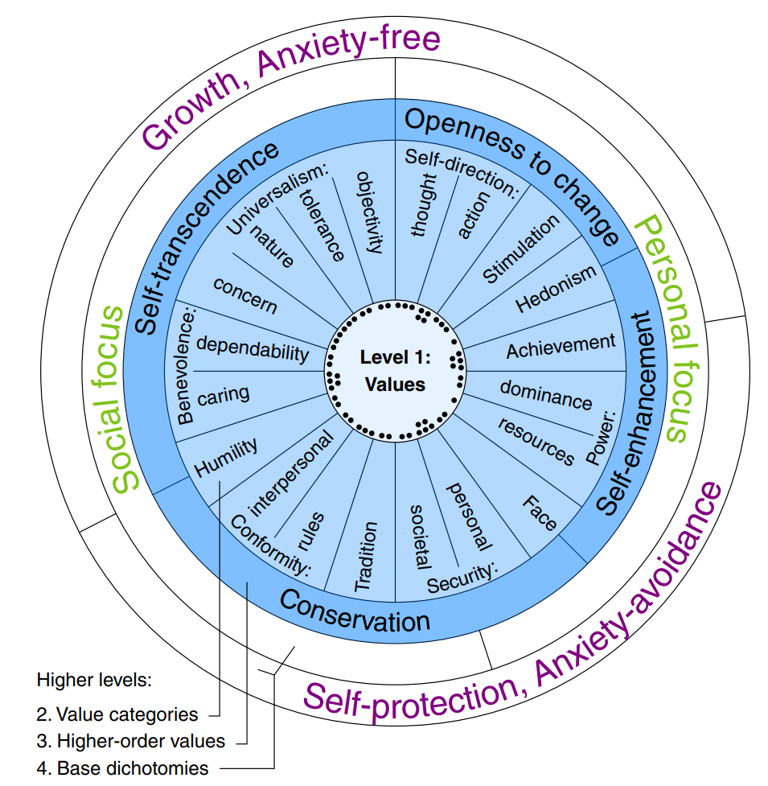
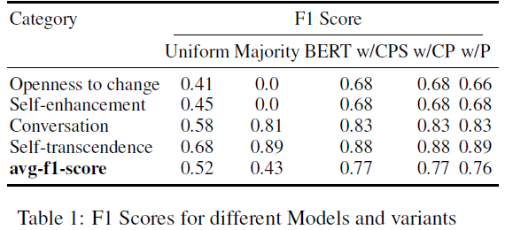

# Human Value Detection
This project addresses the Human Value Detection Challenge, where the objective is to classify, given a textual argument and a human value category, classify whether or not the argument draws on that category. 
Human values behind natural language arguments, such as to have 'freedom of thought' or to be 'broad-minded' are commonly accepted answers and logic to why something is desirable in the ethical sense and are thus essential both in real world argumentation and theoretical argumentation frameworks. The goal is to perform automatic multi label classification using several neural models considering solely level 3 value categories. The experimentation achieved a maximum F1-score of 0.88 and an average of 0.77.

## Problem definition

Arguments are paired with their conveyed human values.
Arguments are in the form of **premise** $\rightarrow$ **conclusion**.

### Example:

**Premise**: *``fast food should be banned because it is really bad for your health and is costly''*

**Conclusion**: *``We should ban fast food''*

**Stance**: *in favour of*

    

## Corpus

The official page of the challenge [here](https://touche.webis.de/semeval23/touche23-web/) offers several corpora for evaluation and testing.

I worked with the standard training, validation, and test splits.

**Arguments** : * arguments-training.tsv * arguments-validation.tsv * arguments-test.tsv

**Human values** : * labels-training.tsv * labels-validation.tsv * labels-test.tsv

### Annotations

To address a multi-label classification problem, I consider **level 3** categories:

* Openness to change
* Self-enhancement
* Conversation
* Self-transcendence

## Introduction

[The original paper](https://downloads.webis.de/publications/papers/kiesel_2022b.pdf) studies the human values behind natural language arguments. The authors introduced a comprehensive taxonomy comprising 54 values and curated a  dataset of 5270 arguments from four geographical cultures, manually annotated for human values. They compared three approaches, BERT, SVM, and 1-Baseline with training/testing on 'Premise' arguments for category wise classification.
In line with their work, I consider only level 3 value categories and compared the classification over three models, Baselines: **Uniform** , **Majority** classifier and **BERT**. Extending their approach by adding three different variants of BERT:

**BERT w/ C**: a BERT-based classifier that receives an argument conclusion as input.

**BERT w/ CP**: adding argument premise as an additional input.

**BERT w/ CPS**: adding argument premise-to-conclusion stance as an additional input.

## Experimental setup and results
* **Baseline**
  
The baseline model is trained for each category independently utilizing scikit-learn's **DummyClassifier** with for **random and majority** classification. It is used with default settings with three different random state (seed) to control the randomness. Trained models were saved in the specified model directory for use during prediction.
* **BERT**
  
I utilized Hugging Face [**AutoModelForSequenceClassification**](https://huggingface.co/docs/transformers/model_doc/auto#transformers.AutoModelForSequenceClassification) with pre-trained *'roberta-large'*, with a custom **MultiLabelTrainer** class extending the Trainer class from the transformers library. It overrides the compute-loss method for custom loss computation using a combination of Binary Cross Entropy which is implemented as **BCEWithLogitsLoss** in PyTorch. We fine-tuned the model with *batch size 16, learning rate* $2^{-5}$ *(5 epochs) and weight decay 0.01*. BERT input data was tokenized using the *AutoTokenizer* from HuggingFace. The trained BERT model was saved in the specified model directory and used *'macro-average F1-score'* for selecting the best model. 

## Analysis
* The experimentation primarily succeeded in enhancing the test macro average F1-score from **0.71 to 0.77** for level 3 categories.
* While the classification results across various variants did not exhibit substantial differences, but observed improved scores when classifying *'Premise' and 'Conclusion'* arguments compared to using only *'Premise'* as input. Also suggesting that the inclusion of *'Stance'* (S) does not significantly impact performance in this context.
* The rsults on test set are in Table 1.

    

## Flow of the notebook
The notebook will be divided into seperate sections to provide a organized walk through the process used. The sections are:

1. Importing Python Libraries and preparing the environment
2. Importing and Pre-Processing the domain data
3. Preparing the Dataset suitable for BERT
4. Fine Tuning the Model
5. Training and Validating the Model Performance on the trained Model for three different seeds
6. Predicting on Test set for three different seeds
7. Comparing the different models and their variants
8. Analysing for errors on the best model
